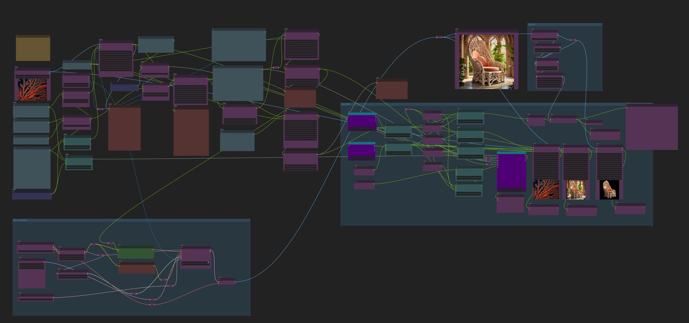

# 3D-Bionic-Designer

[English](./README.md) | [日本語](./README_JP.md) | 简体中文

# 项目介绍
- Agent驱动的3D仿生产品设计师，使用Comfyui后端 + Gradio前端。
- 仅需输入需要参考的生物名称、图片，以及要设计的目标（例如桌子、椅子、小型展馆等），即可以生成对应的仿生产品，并输出响应的文案、图片和3D模型。
- LLM / LVM 模型会首先解析输入信息，按照"设计思路文案"→"方案视觉描述文案"→"prompt"→"2D图形输出"→"3D模型输出"的步骤完成自主设计。
- 所有计算均在本地使用开源模型完成，不需要API及联网功能（安装完成后）。

https://github.com/user-attachments/assets/b00c4220-d333-43af-80e8-443726b10f05

# 安装方法
## 安装Comfyui
- 安装 [comfyui](https://github.com/comfyanonymous/ComfyUI?tab=readme-ov-file#installing)
- 安装 [comfyui-manager](https://github.com/ltdrdata/ComfyUI-Manager?tab=readme-ov-file)
- 运行 comfyui，并载入[工作流文件](./3D-Bionic-Product-Designer-V10.json), 尝试使用comfyui-manager安装缺失的插件。
    - 如果无法安装，请手动安装，需要安装的comfyui插件有：[Comfyui-Ollama-Describer](https://github.com/alisson-anjos/ComfyUI-Ollama-Describer), [comfyui-3D-pack](https://github.com/MrForExample/ComfyUI-3D-Pack), [comfyui-mixlab-nodes](https://github.com/shadowcz007/comfyui-mixlab-nodes), [Comfyui-Easy-Use](https://github.com/yolain/ComfyUI-Easy-Use)

## 安装[ollama](https://ollama.com/)

## 安装其它依赖

```bash
pip install gradio numpy Pillow websocket-client pymeshlab
```

# 运行方法
- 启动ollama
- 启动Comfyui, 载入[工作流文件](./3D-Bionic-Product-Designer-V10.json)，测试在comfyui中是否可以正常工作。

- 修改[app.py](./app.py)中的server_address为Comfyui的地址，例如：`server_address = "127.0.0.1:8188"`
- 修改[app.py](./app.py)中的comfyui_output_path为Comfyui的output路径，例如：`comfyui_output_path = "D:/01_DL/ComfyUI_windows_portable/ComfyUI/output"`，以确保gradio前端可以访问到ComfyUI的输出。
- 启动Gradio前端。
    ```bash
    python app.py
    ```
- 访问 127.0.0.1:7860 ，打开运行界面。


