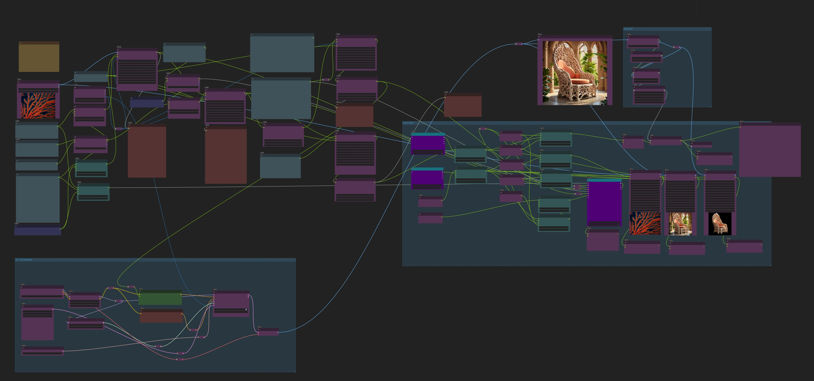
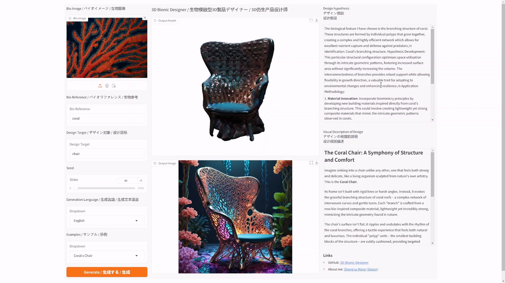

# 3D-Bionic-Designer

[简体中文](./README.md) | [English](./README_EN.md) | 日本語

# プロジェクト紹介
- ComfyUIバックエンド + Gradioフロントエンドを使用したAgent駆動の3Dバイオニック製品デザイナー。
- 参照したい生物の名前、画像、およびデザイン対象（テーブル、椅子、小型展示館など）を入力するだけで、対応するバイオニック製品を生成し、テキスト、画像、3Dモデルを出力します。
- LLM / LVMモデルは、入力情報を最初に解析し、「デザインコンセプトテキスト」→「ビジュアル説明テキスト」→「プロンプト」→「2D画像出力」→「3Dモデル出力」の手順で自律的にデザインを完成させます。
- すべての計算はオープンソースモデルを使用してローカルで実行され、APIやインターネット接続は不要です（インストール後）。


# インストール方法
## Comfyuiのインストール
- [comfyui](https://github.com/comfyanonymous/ComfyUI?tab=readme-ov-file#installing)をインストール
- [comfyui-manager](https://github.com/ltdrdata/ComfyUI-Manager?tab=readme-ov-file)をインストール
- comfyuiを実行し、[ワークフローファイル](./3D-Bionic-Product-Designer-V10.json)を読み込み、comfyui-managerを使用して不足しているプラグインをインストールしてください。
    - インストールできない場合は、手動でインストールしてください。必要なcomfyuiプラグイン：[Comfyui-Ollama-Describer](https://github.com/alisson-anjos/ComfyUI-Ollama-Describer), [comfyui-3D-pack](https://github.com/MrForExample/ComfyUI-3D-Pack), [comfyui-mixlab-nodes](https://github.com/shadowcz007/comfyui-mixlab-nodes), [Comfyui-Easy-Use](https://github.com/yolain/ComfyUI-Easy-Use)

## [ollama](https://ollama.com/)のインストール

## その他の依存関係のインストール

```bash
pip install gradio numpy Pillow websocket-client pymeshlab
```

# 実行方法
- ollamaを起動
- Comfyuiを起動し、[ワークフローファイル](./3D-Bionic-Product-Designer-V10.json)を読み込み、comfyui内で正常に動作するかテストします。

- [app.py](./app.py)内のserver_addressをComfyuiのアドレスに変更します。例：`server_address = "127.0.0.1:8188"`
- [app.py](./app.py)内のcomfyui_output_pathをComfyuiの出力パスに変更します。例：`comfyui_output_path = "D:/01_DL/ComfyUI_windows_portable/ComfyUI/output"`。これにより、GradioフロントエンドがComfyUIの出力にアクセスできるようになります。
- Gradioフロントエンドを起動します。
    ```bash
    python app.py
    ```
- 127.0.0.1:7860にアクセスして、実行インターフェースを開きます。
 